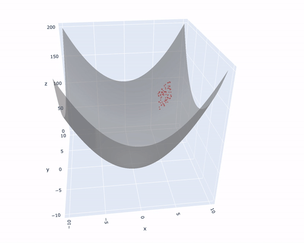

# Particle Swarm Optimization

In this project we are going to apply the PSO metaheuristic to a simple function, in this case, an elliptic paraboloid. The main idea is to be able to visualize its operation by means of a plotly animation. 

The result can be seen below for the following parameters:

* alpha: 0.7
* beta: 0.6
* gamma: 0.9
* delta: 0.0 
* epsilon: 1.0
* n_particles: 75
* n_informants: 30

